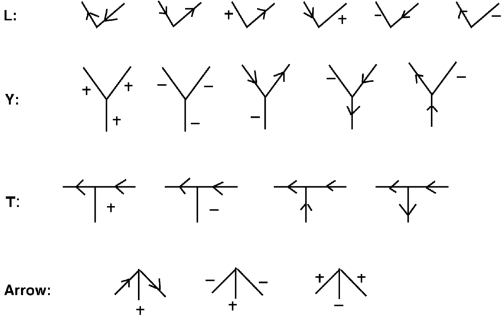

### Defining the Problem
Example: map coloring problem - How many colors do you need for a map based on coloring constraint that no adjacent regions have the same color?  
1). Define variables (regions)  
2). Define values (colors, discrete or continuous)  
3). Define contraints (unary, binary, n-ary, global)  
a. unary 
b. binary
c. n-ary means variables
d. global means all values are different
e. linear and non-linear constraints  

### Algorithms
Algorithms take into account soft and hard constraints which can either be preferences or requirements respectively.  
Some **properties** that are relevant include **completeness** (if there is a solution, the algorithm will find it; in terms of constraint satisfaction, it means that every variable gets a value that satisfies constraints), **cost optimality**, **consistency** (all constraints are satisfied), **complexity** of algorithm.  
Most constraint satisfaction problems can be represented as search algorithms. One way to represent the map coloring problem as a search is to have alternating layers of variables and possible values. This can be solved with a DFS. For this DFS, all solutions are the same cost because it is bounded by the number of variables and values.  

### Heuristics
While A* uses domain dependent heuristics (context is needed to make predictions), constraint satisfaction should use domain independent heuristics to *speed up the search*.  
One such heuristic could be to *select the **variables** with the smallest number of possible values to explore* (Minimum Remaining Value MRV) first because with less values to explore, the possibility of failing faster and moving on it higher as opposed to testing many values early on.  
Another heuristic is to *start with the **variables** with most constraints*. This also encourages failing faster.  
Another heuristic is to *select the **value** with least constraint because this is the one that is most likely to succeed*.  
To apply heuristics to other problems, you can relax the constraints and then look for a solution, this is a good heuristic. 

### Crypto Arithmetic
```
    EAT +
   THAT =
-----------
  APPLE

{A,E,H,L,P,T} can each be [0:9]
E, T, A != 0
A = 1

T = 9
E = 8
L = 3
P = 0
E + H = 10
H = 2

819 + 9219 = 10038
```

Explanation:
```
With MRV Heuristic we choose to explore A first
A is in [1]
We know that, T + c3 = P + 10A
T + c3 = P + 10
c3 = [0,1] but T + 0 = P + 10 cannot have a solution
So c3 = 1
T + 1 = P + 10
T - P = 9
The only possible solution for that would be T = 9 and P = 0
This leaves us with T=9, we know that T + T = E + 10c1
18 = E + 10c1
8 + 10 = E + 10c1
That leaves us with c1 = 1 and E = 8
A + A + c1 = L + 10c2
1 + 1 + 1 = L + 10c2
3 + 0 = L + 10c2
So L=3 and c2 = 0
E + H + c2 = P + 10c3
8 + H + 0 = 0 + 10
So H = 2
```
With degree constraint, we would use "A" to solve first since A occurs the most, we know A = 1 so we can quickly solve for "L" which is 2.  

### Constraints
For cryptoarithmetic, some constraints include first digits not equalling 0, and sums with more digits than the parts having "1" as the leading digit. 

### Local Search
Can be very efficient, especially with those things that have multiple solutions.  
An example is the 8 queens problem with a heuristic of minimizing conflict

### AC-3
Looks at all possible choices for values and removed inconsistent choices by looking at arc consistency.  
Looking at 2D images and converting to 3D is one of those problems. 
  
For each vertice in the picture, we need to test the above possible junctions.  
As we make subsequent choices, it may become apparent that previous choices are not consistent, so we can eliminate those. 

### Questions
So a constraint satisfaction search really just is a permuations expansion with hueristics/constraints?  
